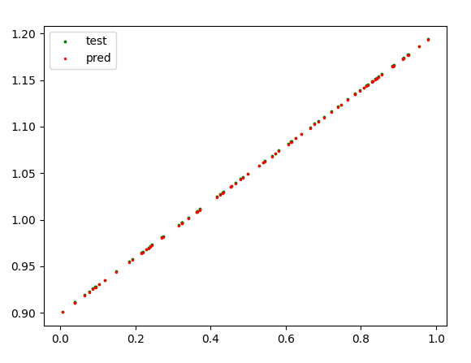
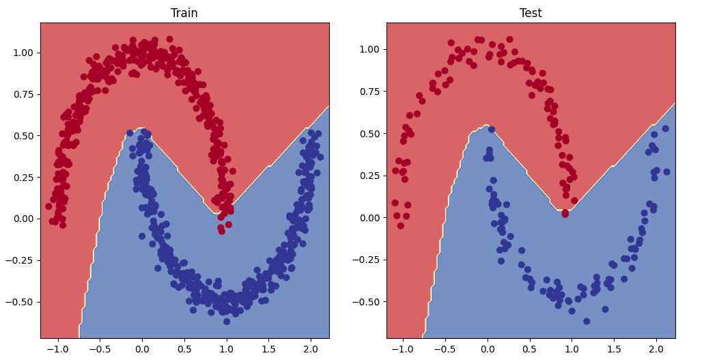
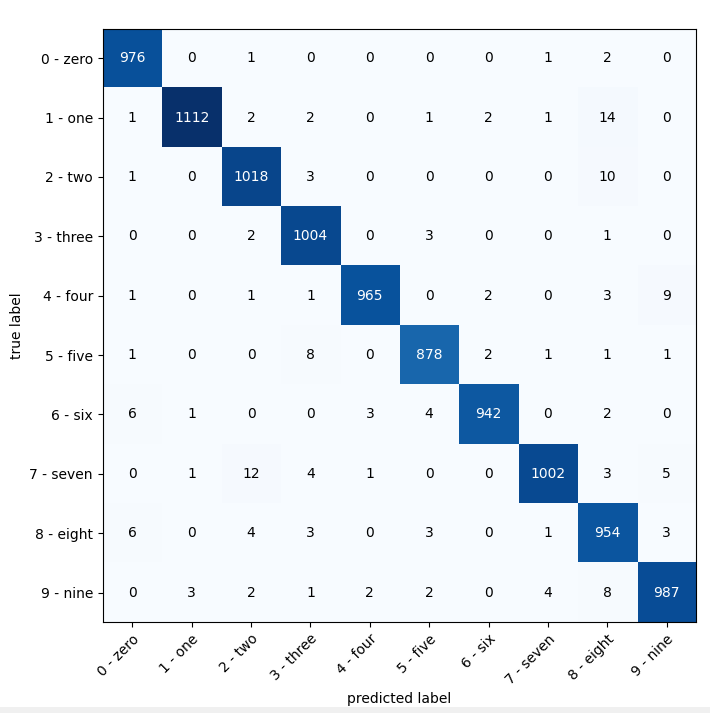
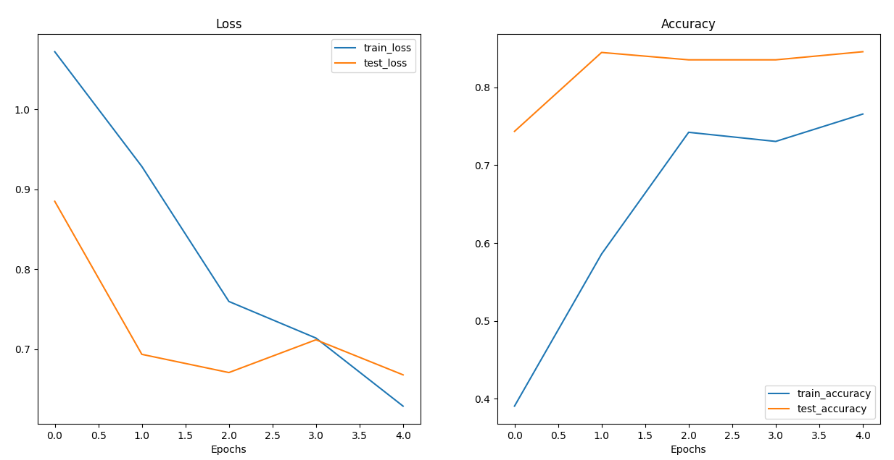
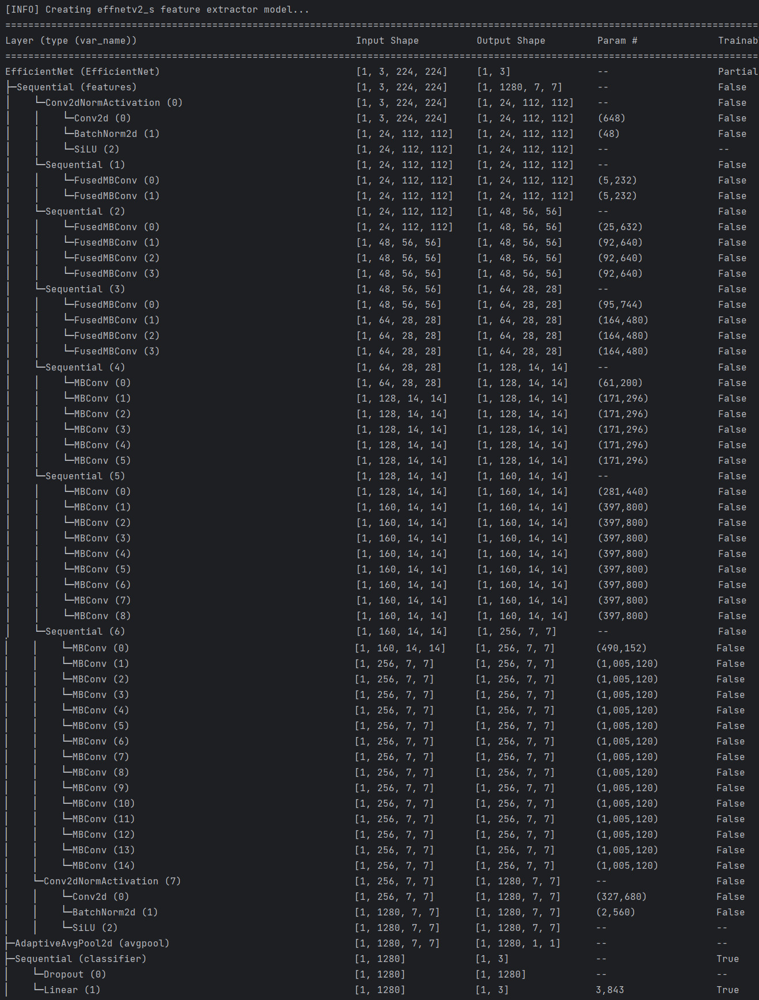
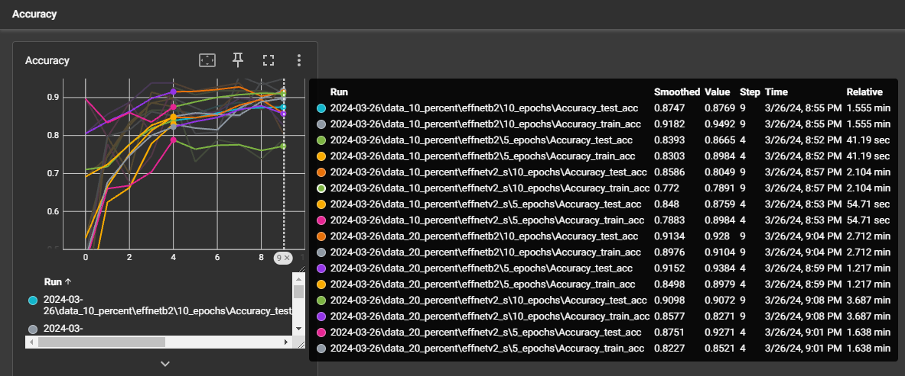
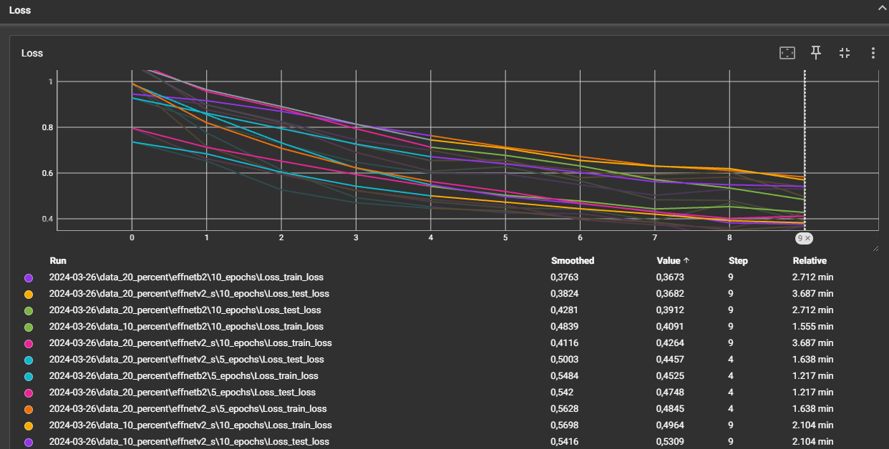

# PyTorch Tasks

This repository contains a collection of PyTorch tasks aimed to practice at PyTorch.

## Table of Contents

1. [Introduction](#introduction)
2. [Tasks](#tasks)
3. [Requirements](#requirements)
4. [Screenshots](#screenshots)

## Introduction

PyTorch is an open-source machine learning library developed by Facebook's AI Research lab. It provides a flexible framework for building and training neural networks, with support for GPU acceleration and dynamic computation graphs.

## Tasks

The tasks included in this repository cover a range of topics, including:

- Tensor basics
- Classification
- CV (cnn)
- DataLoaders
- Transfer learning
- Metrics tracking

## Screenshots

